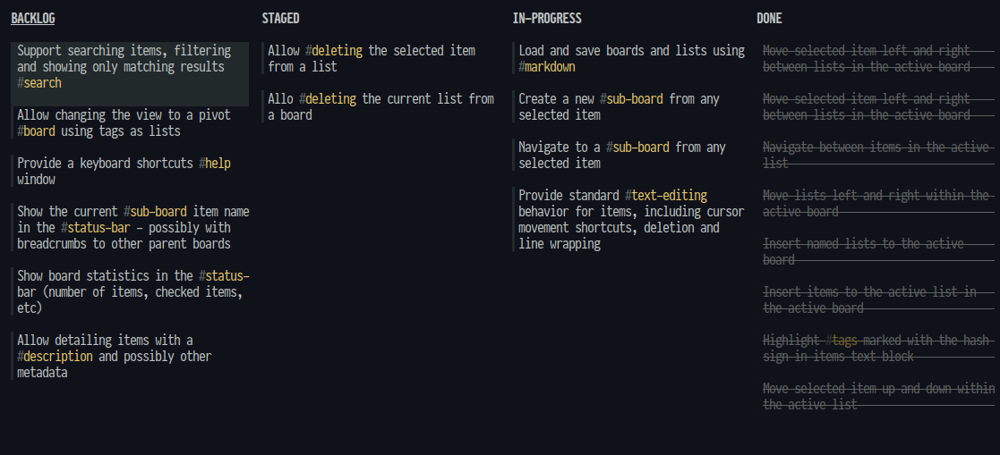

# OPPENHEIMER

## Earn your reputation, one task at a time

**OPPENHEIMER** is a Taskell-inspired hierarchical listboard app, perfect for terminal lovers who hope to make the world a better place.

**OPPENHEIMER** is for the organized scientist. Whether you're plotting world domination or just trying to get through Monday, this listboard app will help you stay on track - or not.

## Features

- 📋 **Hierarchical Listboards**: Because sometimes simple listboards just don't cut it.
- 🌈 **Lean & Simple**: Less bells, less whistles.
- ⚡ **Fast & Efficient**: Built for the keyboard-oriented mad scientist.
- 🛠️ **Customizable?**: Yes! just tweak the code to suit your style or theme of the day.
- 🚀 **Terminal-based**: For those who live and breathe the terminal.

## Get Started

1. **Clone the Repo**: `git clone https://github.com/rlofc/oppenheimer.git`
2. **Dive In**: Navigate to the directory and run `cargo build --release`
3. **Create Your First List**: Start organizing like a pro! using `cargo run --release my_project.md`

## Key-mapping

| Key Combination                | Action                        |
| ------------------------------ | ----------------------------- |
| `Ctrl + o`                     | Insert list to board          |
| `o`                            | Insert item to current list   |
| `Ctrl + d`                     | Delete a list                 |
| `d`                            | Delete an item                |
| `Down` or `j`                  | Move down                     |
| `Up` or `k`                    | Move up                       |
| `Right` or `l`                 | Move right                    |
| `Left` or `h`                  | Move left                     |
| `Ctrl + Left` or `Ctrl + h`    | Move item to previous list    |
| `Ctrl + Right` or `Ctrl + l`   | Move item to next list        |
| `Ctrl + Down` or `Ctrl + j`    | Deprioritize selected item    |
| `Ctrl + Up` or `Ctrl + k`      | Prioritize selected item      |
| `Shift + Left` or `Shift + h`  | Shuffle list forward          |
| `Shift + Right` or `Shift + l` | Shuffle list back             |
| `Enter`                        | Edit current item             |
| `Space`                        | Toggle current item selection |
| `Tab`                          | Open item sub-board           |
| `Esc`                          | Go back to the previous board |
| `u`                            | Undo action                   |
| `r`                            | Redo action                   |
| `q`                            | Quit application              |

## Contribution

Feeling adventurous? Fork the repo and add your magic touch. PRs are always welcome!

## License

OPPENHEIMER is licensed under the BSD License, so feel free to use, modify, and distribute it to your heart's content.
